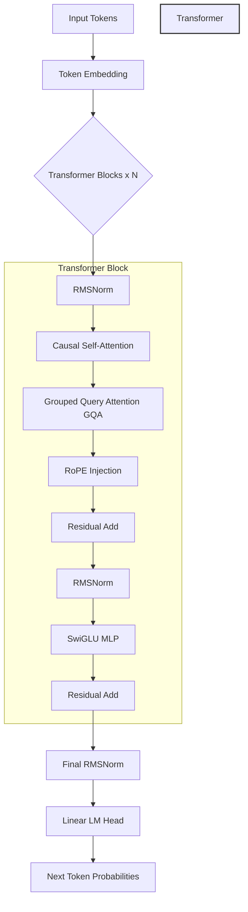

# microGPT 🧠

<div align="center">
  
</div>

<p align="center">
  <b>A modern, from-scratch, decoder-only GPT implementation in PyTorch.</b>
</p>

<p align="center">
  
  
  
</p>

## Overview
microGPT is a compact, high-performance autoregressive language model built from first principles. Unlike vanilla 2017 Transformer clones, microGPT implements the modern (2025/2026-era) architectural decisions found in state-of-the-art open-weight models like Llama 3, Mistral, and Gemma. 

## Modern Architecture Highlights

| Feature | Implementation Detail | Why it matters |
|---------|------------------------|----------------|
| **Positional Encoding** | RoPE (Rotary Positional Embeddings) | Encodes relative position directly into the attention dot product, generalizing better to longer sequences. |
| **Normalization** | RMSNorm (Pre-Norm) | Computationally cheaper than LayerNorm while maintaining training stability at depth. |
| **Feedforward** | SwiGLU | Replaces standard GELU for better representation capacity (used in PaLM, Llama). |
| **Attention** | Grouped Query Attention (GQA) | Reduces KV cache memory footprint drastically during inference with negligible quality loss. |
| **Kernel Dispatch** | `F.scaled_dot_product_attention` | Automatically routes to Flash Attention v2 on supported hardware for optimal memory and throughput. |
| **Inference** | KV Caching | Prevents recomputation of past tokens during autoregressive generation. |

## Architecture Diagram



## Results

### Training Loss Curve
*(Placeholder for WandB/matplotlib loss curve after full training run)*
<div align="center">
  
</div>

### Sample Generations
*(Placeholder for sample generation after training on TinyStories)*
```text
[Prompt]: Once upon a time
[Completion]: ...
```

## Quickstart (Colab / Kaggle)

You can clone and train microGPT directly in a single cell on a free-tier GPU (T4). 
*Note for Kaggle users: Ensure your notebook settings have GPU T4 x2 enabled and clone into a relative working path.*

```python
!git clone https://github.com/Paramveersingh-S/microgpt.git
%cd microgpt
!pip install -q -r requirements.txt

# Prepare dataset (TinyStories subset)
!python data/prepare_data.py --dataset tinystories

# Train the model (compilation is optional but recommended)
!python train.py \
    --dataset tinystories \
    --n_layer 6 --n_head 6 --n_embd 384 --block_size 256 \
    --batch_size 64 --grad_accum_steps 1 \
    --max_iters 3000 --eval_interval 250 \
    --pos_encoding rope --norm_type rmsnorm --mlp_type swiglu \
    --compile

# Sample from the trained model
!python sample.py \
    --checkpoint checkpoints/ckpt.pt \
    --prompt "Once upon a time" \
    --max_new_tokens 200 \
    --temperature 0.8 \
    --top_k 50
```

## Scaling Up
To scale microGPT for production or large-scale training:
1. **Multi-GPU (DDP/FSDP)**: Transition the training loop from single-device to DistributedDataParallel or FullyShardedDataParallel to handle larger batch sizes and parameter counts.
2. **Dataset Size**: Swap the TinyStories subset for a larger corpus like FineWeb or RedPajama.
3. **Advanced GQA/RoPE**: At larger scales, GQA becomes critical for serving memory constraints, and RoPE base frequencies should be increased (e.g., to 500,000) for extremely long context windows.
